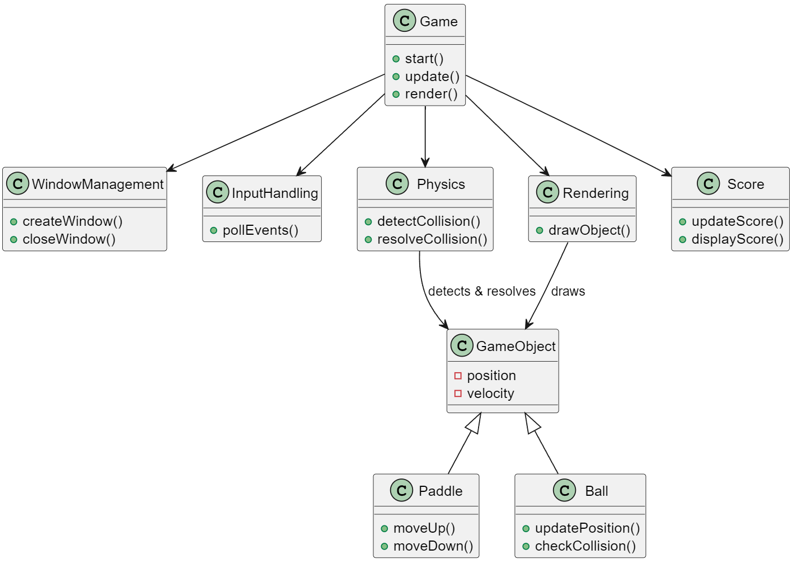

# Pong Game

Small "Pong" game project created for learning purposes. This project uses modern C++ practices and libraries such as GLFW, GLEW, GLM, SPDLOG, and Google Test for unit testing. The game is a simple implementation of the classic Pong game with basic physics, input handling, and score tracking.

## Design

The game architecture is designed around several key components to manage different aspects of the game lifecycle and functionality:

- **Game Loop**: Central loop controlling the game state updates and rendering.
- **Window Management**: Handles the creation, display, and closing of the game window.
- **Input Handling**: Manages user inputs, such as paddle movement via keyboard.
- **Game Objects**: Represents entities in the game, primarily the paddles and ball.
- **Physics**: Manages the movement of the game objects and detects collisions.
- **Rendering**: Draws the game objects to the screen each frame.
- **Score**: Keeps track of and displays the players' scores.



### Components Explanation

- **Game**: Central class that inits the game components, contains the game loop, and coordinates the game flow.
- **WindowManager**: Manages the lifecycle of the game window.
- **InputHandling**: Processes user input and updates game state accordingly.
- **GameObject**: Base class for any object in the game, with Paddle and Ball as subclasses inheriting common properties like position and velocity.
- **Physics**: Handles the logic for moving objects and detecting collisions.
- **Rendering**: Responsible for drawing the game objects to the window.
- **Score**: Tracks and displays the game score.

## Dependencies

To build and run this game, you'll need the following libraries:

- GLFW 3.3.8
- GLEW 2.2.0
- GLM 0.9.9.8
- SPDLOG 1.12.0
- Google Test 1.14.0

You can easily install these dependencies using Conan, a C++ package manager. A `conanfile.txt` is provided in the root of the project to simplify this process:

```plaintext
[requires]
glfw/3.3.8
glew/2.2.0
glm/0.9.9.8
spdlog/1.12.0
gtest/1.14.0

[generators]
CMakeDeps
CMakeToolchain
```

## Building the Project

```
conan install . --output-folder=build --build=missing
cd build
cmake .. --preset conan-debug -DCMAKE_BUILD_TYPE=Debug
cmake --build .
```

Alternatively you could use my VSCode [tasks.json](docs/vscode_config/tasks.json) (only Windows) to run `clean-rebuild` task.

## Running the Game

For Windows:
```
.\bin\pong_game.exe
```
or for Linux:
```
./bin/pong_game
```

## Contributing

Project created for learning purpose, so your contribution is not needed. But you can fork this guy and do whatever you want :kissing_cat:

## License

This project is licensed under the terms of the [MIT LICENCE](LICENSE).
