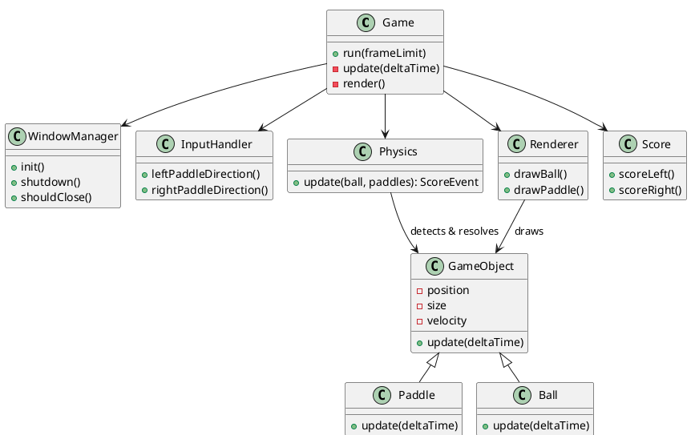

# Pong Game

[](https://github.com/Sage-Cat/pong_game/actions/workflows/ci.yml)

A small two-player Pong game written in C++20 with OpenGL 3.3, GLFW, GLEW,
GLM, and spdlog. It is a learning project with a compact game loop, deterministic
collision tests, and a virtual-display startup check.

## Controls

- Left paddle: `W` / `S`
- Right paddle: Up / Down arrows
- Quit: `Esc` or close the window

The score appears in the window title. The ball resets after each point.

## Build

The continuously tested platform is Ubuntu 24.04. Install the native packages:

```sh
sudo apt-get install g++ cmake ninja-build libglfw3-dev libglew-dev libglm-dev libspdlog-dev libgl1-mesa-dev
cmake -S . -B build -G Ninja -DCMAKE_BUILD_TYPE=Release
cmake --build build
ctest --test-dir build --output-on-failure
./build/bin/pong_game
```

Alternatively, Conan 2 can provide the dependencies:

```sh
conan profile detect --force
conan install . --output-folder=build --build=missing -s build_type=Release -s compiler.cppstd=20
cmake --preset conan-release
cmake --build --preset conan-release
ctest --preset conan-release --output-on-failure
```

Windows is intended to work through the same CMake/Conan build, but is not
currently covered by CI.

## Design



`Game` coordinates GLFW input, gameplay state, physics, scoring, and rendering.
`pong_core` contains the window-independent movement and collision rules used by
the deterministic tests. Shader source is copied beside the build output at
configure time; no third-party media assets are bundled.

## Limitations

This remains a local two-player prototype: it has no audio, menus, AI opponent,
network play, saved settings, or packaged installer. Collision detection is
discrete and may tunnel at unusually high speeds.

## License

This project is licensed under the [MIT License](LICENSE).
